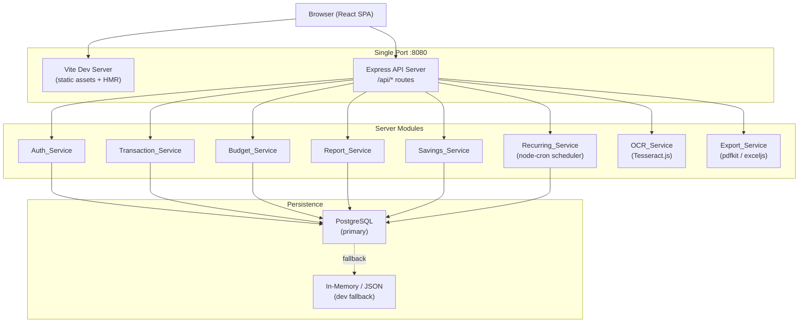
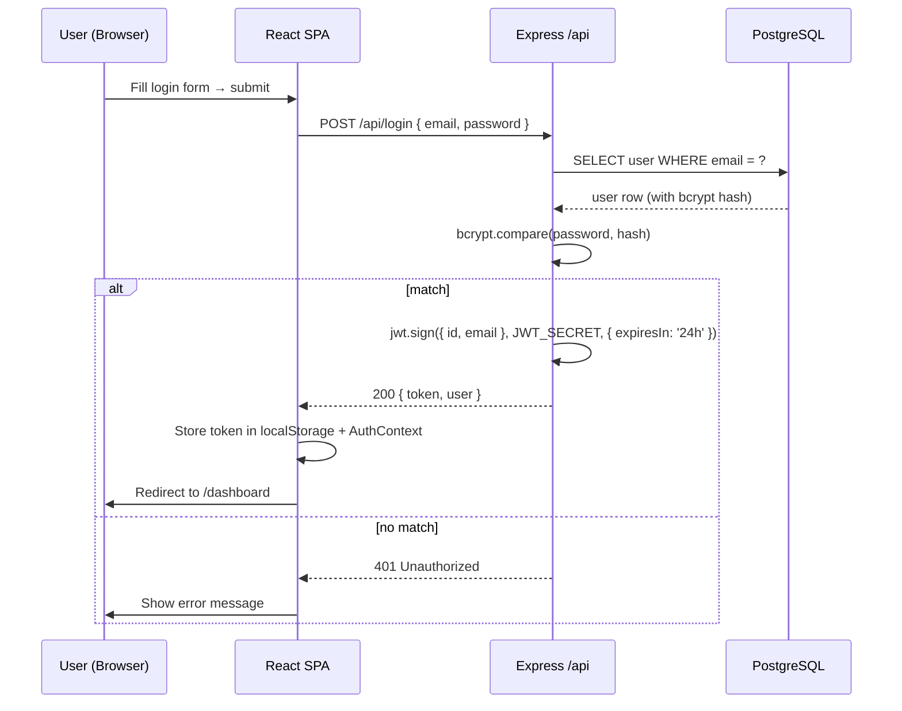
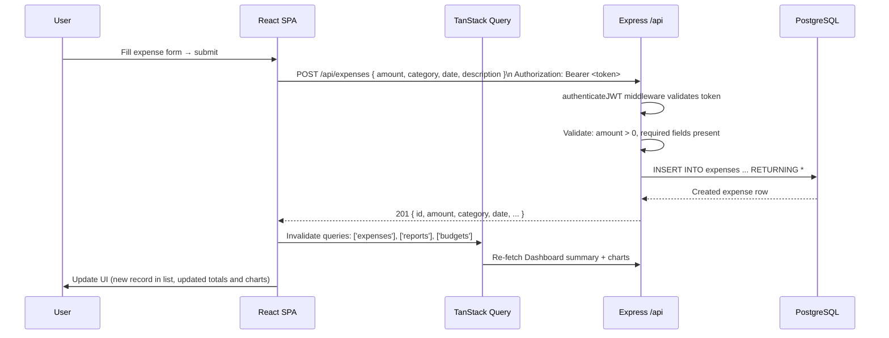
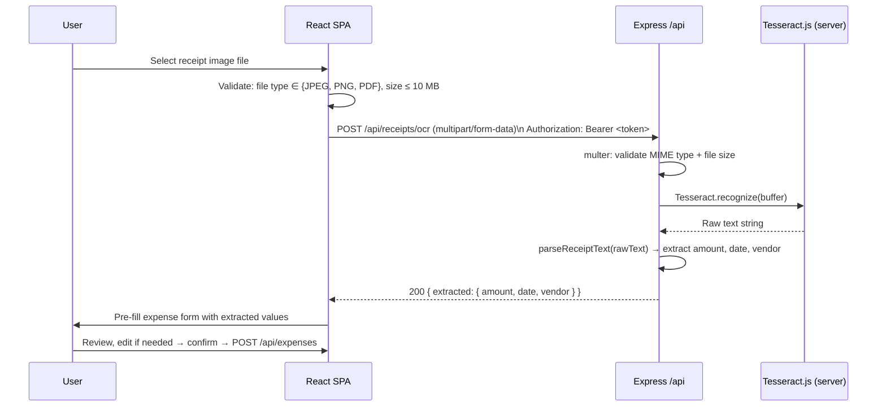

# Design Document — FinSight

## Overview

FinSight is a full-stack single-page application that lets users record income and expenses, manage budgets with alert thresholds, visualise spending patterns through charts, track savings goals, automate recurring transactions, scan receipts via OCR, and export reports to PDF or Excel. All monetary values are denominated in **GHS (Ghana Cedis)**.

The application is built on the **Fusion Starter** template:

- **Frontend**: React 18 + React Router 6 (SPA mode) + TypeScript + Vite + TailwindCSS 3 + Radix UI + Lucide icons
- **Backend**: Node.js + Express, integrated into the Vite dev server — single port **8080** in development
- **Database**: PostgreSQL (`pg` / `postgres` driver) with a JSON/in-memory fallback for development environments that lack a running Postgres instance
- **Auth**: JWT (24-hour expiry), `bcryptjs` for password hashing, `Authorization: Bearer <token>` header convention
- **Charts**: Chart.js via `react-chartjs-2` (Pie, Bar, Line)
- **OCR**: Tesseract.js running server-side
- **PDF export**: `pdfkit`
- **Excel export**: `exceljs`
- **Recurring scheduler**: `node-cron` running server-side
- **All API routes** are prefixed with `/api/`

---

## Architecture

### High-Level Architecture



### File Structure

```
client/
├── pages/
│   ├── Index.tsx          # Landing / Login+Register page
│   ├── Dashboard.tsx      # Financial summary + charts
│   ├── Transactions.tsx   # Income & expense management
│   ├── Budgets.tsx        # Budget management
│   ├── Reports.tsx        # Monthly reports + export
│   ├── SavingsGoals.tsx   # Savings goal tracking
│   └── NotFound.tsx
├── components/
│   ├── ui/                # Pre-built Radix/shadcn components
│   ├── layout/
│   │   ├── AppShell.tsx   # Sidebar + topbar wrapper
│   │   └── ProtectedRoute.tsx
│   ├── charts/
│   │   ├── PieChart.tsx
│   │   ├── BarChart.tsx
│   │   └── LineChart.tsx
│   ├── forms/
│   │   ├── IncomeForm.tsx
│   │   ├── ExpenseForm.tsx
│   │   ├── BudgetForm.tsx
│   │   ├── SavingsGoalForm.tsx
│   │   └── RecurringExpenseForm.tsx
│   └── dashboard/
│       ├── SummaryCard.tsx
│       ├── BudgetAlert.tsx
│       └── SavingsGoalCard.tsx
├── hooks/
│   ├── useAuth.ts
│   ├── useIncome.ts
│   ├── useExpenses.ts
│   ├── useBudgets.ts
│   ├── useSavingsGoals.ts
│   ├── useRecurring.ts
│   └── useReports.ts
├── lib/
│   ├── api.ts             # fetch wrapper with JWT injection
│   ├── formatCurrency.ts  # GHS formatting utilities
│   └── utils.ts
├── App.tsx
└── global.css

server/
├── index.ts               # createServer() — registers all routes
├── middleware/
│   └── auth.ts            # JWT verification middleware
├── routes/
│   ├── auth.ts
│   ├── income.ts
│   ├── expenses.ts
│   ├── budgets.ts
│   ├── reports.ts
│   ├── savingsGoals.ts
│   ├── recurringExpenses.ts
│   ├── ocr.ts
│   └── export.ts
├── services/
│   ├── authService.ts
│   ├── transactionService.ts
│   ├── budgetService.ts
│   ├── reportService.ts
│   ├── savingsService.ts
│   ├── recurringService.ts
│   ├── ocrService.ts
│   └── exportService.ts
├── db/
│   ├── index.ts           # DB connection factory (pg pool or fallback)
│   ├── schema.ts          # CREATE TABLE statements + migrate()
│   └── fallback.ts        # In-memory store for dev without Postgres
└── node-build.ts

shared/
└── api.ts                 # All request/response TypeScript interfaces
```

---

## Database Schema

All amounts are stored as `NUMERIC(12,2)` representing GHS values.

```sql
-- Users
CREATE TABLE users (
    id          SERIAL PRIMARY KEY,
    email       VARCHAR(255) UNIQUE NOT NULL,
    name        VARCHAR(255) NOT NULL,
    password    VARCHAR(255) NOT NULL,      -- bcrypt hash
    created_at  TIMESTAMPTZ DEFAULT NOW()
);

-- Income records
CREATE TABLE income (
    id          SERIAL PRIMARY KEY,
    user_id     INTEGER NOT NULL REFERENCES users(id) ON DELETE CASCADE,
    amount      NUMERIC(12,2) NOT NULL CHECK (amount > 0),
    category    VARCHAR(100) NOT NULL,
    description TEXT,
    date        DATE NOT NULL,
    created_at  TIMESTAMPTZ DEFAULT NOW(),
    updated_at  TIMESTAMPTZ DEFAULT NOW()
);

-- Expense records
CREATE TABLE expenses (
    id          SERIAL PRIMARY KEY,
    user_id     INTEGER NOT NULL REFERENCES users(id) ON DELETE CASCADE,
    amount      NUMERIC(12,2) NOT NULL CHECK (amount > 0),
    category    VARCHAR(100) NOT NULL,
    description TEXT,
    date        DATE NOT NULL,
    created_at  TIMESTAMPTZ DEFAULT NOW(),
    updated_at  TIMESTAMPTZ DEFAULT NOW()
);

-- Monthly budgets
CREATE TABLE budgets (
    id          SERIAL PRIMARY KEY,
    user_id     INTEGER NOT NULL REFERENCES users(id) ON DELETE CASCADE,
    amount      NUMERIC(12,2) NOT NULL CHECK (amount >= 0),
    month       SMALLINT NOT NULL CHECK (month BETWEEN 1 AND 12),
    year        SMALLINT NOT NULL CHECK (year >= 2000),
    created_at  TIMESTAMPTZ DEFAULT NOW(),
    updated_at  TIMESTAMPTZ DEFAULT NOW(),
    UNIQUE (user_id, month, year)
);

-- Savings goals
CREATE TABLE savings_goals (
    id              SERIAL PRIMARY KEY,
    user_id         INTEGER NOT NULL REFERENCES users(id) ON DELETE CASCADE,
    name            VARCHAR(255) NOT NULL,
    target_amount   NUMERIC(12,2) NOT NULL CHECK (target_amount > 0),
    target_date     DATE NOT NULL,
    status          VARCHAR(20) NOT NULL DEFAULT 'active'
                    CHECK (status IN ('active', 'achieved')),
    created_at      TIMESTAMPTZ DEFAULT NOW(),
    updated_at      TIMESTAMPTZ DEFAULT NOW()
);

-- Recurring expense templates
CREATE TABLE recurring_expenses (
    id              SERIAL PRIMARY KEY,
    user_id         INTEGER NOT NULL REFERENCES users(id) ON DELETE CASCADE,
    amount          NUMERIC(12,2) NOT NULL CHECK (amount > 0),
    category        VARCHAR(100) NOT NULL,
    description     TEXT NOT NULL,
    interval        VARCHAR(20) NOT NULL
                    CHECK (interval IN ('daily', 'weekly', 'monthly')),
    next_run_at     TIMESTAMPTZ NOT NULL,
    status          VARCHAR(20) NOT NULL DEFAULT 'active'
                    CHECK (status IN ('active', 'inactive')),
    created_at      TIMESTAMPTZ DEFAULT NOW(),
    updated_at      TIMESTAMPTZ DEFAULT NOW()
);
```

### Index Strategy

```sql
CREATE INDEX idx_income_user_date    ON income (user_id, date DESC);
CREATE INDEX idx_expenses_user_date  ON expenses (user_id, date DESC);
CREATE INDEX idx_budgets_user_period ON budgets (user_id, year, month);
CREATE INDEX idx_savings_user        ON savings_goals (user_id);
CREATE INDEX idx_recurring_active    ON recurring_expenses (status, next_run_at)
    WHERE status = 'active';
```

---

## Data Models

The core data models mirror the database schema directly. All amounts flow as `NUMERIC(12,2)` in PostgreSQL and are serialised as strings in API responses to avoid JavaScript floating-point precision loss. The TypeScript interfaces in `shared/api.ts` represent these models as they cross the wire.

### User
| Field | Type | Notes |
|-------|------|-------|
| id | number | Auto-increment PK |
| email | string | Unique, indexed |
| name | string | Display name |
| password | string | bcrypt hash, never serialised to client |
| created_at | string (ISO) | Server-set |

### TransactionRecord (Income & Expense)
| Field | Type | Notes |
|-------|------|-------|
| id | number | Auto-increment PK |
| user_id | number | FK → users.id |
| amount | string | NUMERIC(12,2), positive |
| category | string | e.g. "Salary", "Food", "Transport" |
| description | string? | Optional free text |
| date | string | ISO date "YYYY-MM-DD" |
| created_at / updated_at | string | Timestamps |

### BudgetRecord
| Field | Type | Notes |
|-------|------|-------|
| id | number | Auto-increment PK |
| user_id | number | FK → users.id |
| amount | string | NUMERIC(12,2), ≥ 0 |
| month | number | 1–12 |
| year | number | ≥ 2000 |
| total_expenses | string | Computed at query time |
| remaining | string | Computed: amount − total_expenses (floored at 0) |
| alert | boolean | true when total_expenses > amount |

### SavingsGoal
| Field | Type | Notes |
|-------|------|-------|
| id | number | Auto-increment PK |
| user_id | number | FK → users.id |
| name | string | Goal label |
| target_amount | string | NUMERIC(12,2), > 0 |
| target_date | string | ISO date, must be in future at creation |
| status | "active" \| "achieved" | Derived from progress |
| current_savings | string | Computed: sum(income) − sum(expenses) |
| progress_percentage | number | `round((current / target) * 100, 2)` |

### RecurringExpense
| Field | Type | Notes |
|-------|------|-------|
| id | number | Auto-increment PK |
| user_id | number | FK → users.id |
| amount | string | NUMERIC(12,2), > 0 |
| category | string | Expense category |
| description | string | Required free text |
| interval | "daily" \| "weekly" \| "monthly" | Recurrence frequency |
| next_run_at | string | ISO timestamp of next scheduled execution |
| status | "active" \| "inactive" | Inactive stops cron from processing |

### MonthlyReport (computed, not persisted)
| Field | Type | Notes |
|-------|------|-------|
| year | number | Report year |
| month | number | Report month (1–12) |
| total_income | string | Sum of all income records for period |
| total_expenses | string | Sum of all expense records for period |
| savings | string | total_income − total_expenses |
| expense_by_category | CategoryBreakdown[] | Per-category totals and percentages |

---

## API Design

### Authentication Middleware

Every protected route applies `authenticateJWT` middleware, which:
1. Reads the `Authorization: Bearer <token>` header
2. Verifies the JWT against `process.env.JWT_SECRET`
3. On success, attaches `req.user = { id, email }` and calls `next()`
4. On failure, responds `401 Unauthorized`

### Endpoint Catalogue

#### Auth (public)

| Method | Path | Handler | Description |
|--------|------|---------|-------------|
| POST | `/api/register` | `Auth_Service.register` | Create account |
| POST | `/api/login` | `Auth_Service.login` | Authenticate, return JWT |

**POST /api/register** — Request body:
```json
{ "email": "user@example.com", "name": "Kwame Mensah", "password": "secret123" }
```
Response `201`:
```json
{ "id": 1, "email": "user@example.com", "name": "Kwame Mensah" }
```

**POST /api/login** — Request body:
```json
{ "email": "user@example.com", "password": "secret123" }
```
Response `200`:
```json
{ "token": "<jwt>", "user": { "id": 1, "email": "user@example.com", "name": "Kwame Mensah" } }
```

#### Income (protected)

| Method | Path | Description |
|--------|------|-------------|
| GET | `/api/income` | List all income records, date DESC |
| POST | `/api/income` | Create income record |
| PUT | `/api/income/:id` | Update income record |
| DELETE | `/api/income/:id` | Delete income record (→ 204) |

**Income record shape**:
```json
{
  "id": 1,
  "amount": "2500.00",
  "category": "Salary",
  "description": "Monthly salary",
  "date": "2025-01-15",
  "created_at": "2025-01-15T10:00:00Z"
}
```

#### Expenses (protected)

| Method | Path | Description |
|--------|------|-------------|
| GET | `/api/expenses` | List all expense records, date DESC |
| POST | `/api/expenses` | Create expense record |
| PUT | `/api/expenses/:id` | Update expense record |
| DELETE | `/api/expenses/:id` | Delete expense record (→ 204) |

**Expense record shape** — same structure as income.

#### Budgets (protected)

| Method | Path | Description |
|--------|------|-------------|
| GET | `/api/budgets` | List all budgets (or filter by `?month=&year=`) |
| POST | `/api/budgets` | Create budget |
| PUT | `/api/budgets/:id` | Update budget |

**Budget response shape**:
```json
{
  "id": 1,
  "amount": "3000.00",
  "month": 1,
  "year": 2025,
  "total_expenses": "1850.00",
  "remaining": "1150.00",
  "alert": false
}
```

#### Reports (protected)

| Method | Path | Query params | Description |
|--------|------|-------------|-------------|
| GET | `/api/reports/monthly` | `?year=2025&month=1` | Monthly financial summary |

**Monthly report response shape**:
```json
{
  "year": 2025,
  "month": 1,
  "total_income": "5000.00",
  "total_expenses": "3200.00",
  "savings": "1800.00",
  "expense_by_category": [
    { "category": "Food", "total": "800.00", "percentage": 25.0 },
    { "category": "Transport", "total": "400.00", "percentage": 12.5 }
  ]
}
```

#### Savings Goals (protected)

| Method | Path | Description |
|--------|------|-------------|
| GET | `/api/savings-goals` | List all savings goals with progress |
| POST | `/api/savings-goals` | Create savings goal |
| PUT | `/api/savings-goals/:id` | Update savings goal |

**Savings goal response shape**:
```json
{
  "id": 1,
  "name": "Emergency Fund",
  "target_amount": "5000.00",
  "target_date": "2025-12-31",
  "status": "active",
  "current_savings": "2500.00",
  "progress_percentage": 50.00
}
```

#### Recurring Expenses (protected)

| Method | Path | Description |
|--------|------|-------------|
| GET | `/api/recurring-expenses` | List all active recurring expenses |
| POST | `/api/recurring-expenses` | Create recurring expense template |
| PUT | `/api/recurring-expenses/:id/deactivate` | Deactivate (stop) a recurring expense |

**Recurring expense response shape**:
```json
{
  "id": 1,
  "amount": "500.00",
  "category": "Rent",
  "description": "Monthly apartment rent",
  "interval": "monthly",
  "status": "active",
  "next_run_at": "2025-02-01T00:00:00Z"
}
```

#### OCR (protected)

| Method | Path | Description |
|--------|------|-------------|
| POST | `/api/receipts/ocr` | Upload receipt image, get extracted data |

Request: `multipart/form-data`, field `receipt`, max 10 MB, JPEG/PNG/PDF only.

**OCR response shape**:
```json
{
  "extracted": {
    "amount": { "value": "125.50", "found": true },
    "date":   { "value": "2025-01-14", "found": true },
    "vendor": { "value": "Shoprite Ghana", "found": true }
  }
}
```

#### Export (protected)

| Method | Path | Query params | Response |
|--------|------|-------------|---------|
| GET | `/api/export/pdf` | `?year=2025&month=1` | `application/pdf` download |
| GET | `/api/export/excel` | `?year=2025&month=1` | `application/vnd.openxmlformats-officedocument.spreadsheetml.sheet` download |

---

## Components and Interfaces

### Shared TypeScript Interfaces (`shared/api.ts`)

```typescript
// --- Auth ---
export interface RegisterRequest  { email: string; name: string; password: string; }
export interface LoginRequest     { email: string; password: string; }
export interface AuthResponse     { token: string; user: UserProfile; }
export interface UserProfile      { id: number; email: string; name: string; }

// --- Income / Expenses ---
export interface TransactionRecord {
  id: number;
  amount: string;           // NUMERIC(12,2) serialised as string
  category: string;
  description?: string;
  date: string;             // ISO date "YYYY-MM-DD"
  created_at: string;
  updated_at: string;
}
export interface CreateTransactionRequest {
  amount: number;
  category: string;
  description?: string;
  date: string;
}

// --- Budgets ---
export interface BudgetRecord {
  id: number;
  amount: string;
  month: number;
  year: number;
  total_expenses: string;
  remaining: string;
  alert: boolean;
}
export interface CreateBudgetRequest { amount: number; month: number; year: number; }

// --- Monthly Report ---
export interface MonthlyReport {
  year: number;
  month: number;
  total_income: string;
  total_expenses: string;
  savings: string;
  expense_by_category: CategoryBreakdown[];
}
export interface CategoryBreakdown { category: string; total: string; percentage: number; }

// --- Savings Goals ---
export interface SavingsGoal {
  id: number;
  name: string;
  target_amount: string;
  target_date: string;
  status: "active" | "achieved";
  current_savings: string;
  progress_percentage: number;
}
export interface CreateSavingsGoalRequest { name: string; target_amount: number; target_date: string; }

// --- Recurring Expenses ---
export interface RecurringExpense {
  id: number;
  amount: string;
  category: string;
  description: string;
  interval: "daily" | "weekly" | "monthly";
  status: "active" | "inactive";
  next_run_at: string;
}
export interface CreateRecurringExpenseRequest {
  amount: number;
  category: string;
  description: string;
  interval: "daily" | "weekly" | "monthly";
}

// --- OCR ---
export interface OCRField { value: string | null; found: boolean; }
export interface OCRResponse {
  extracted: { amount: OCRField; date: OCRField; vendor: OCRField; };
}

// --- Errors ---
export interface ApiError { error: string; field?: string; }
```

### Client Page Components

| Page | Route | Responsibility |
|------|-------|---------------|
| `Index.tsx` | `/` | Login and Registration tabs. Redirects to `/dashboard` on successful auth. |
| `Dashboard.tsx` | `/dashboard` | Summary cards (income, expenses, savings), budget alert banner, savings goal progress bars, all three Chart_Component charts. |
| `Transactions.tsx` | `/transactions` | Tabbed view of income and expense records. CRUD forms. Receipt OCR upload. |
| `Budgets.tsx` | `/budgets` | Budget list, budget form, per-month budget status display. |
| `Reports.tsx` | `/reports` | Month/year picker, monthly report summary, charts, PDF/Excel download buttons. |
| `SavingsGoals.tsx` | `/savings-goals` | Savings goal list with progress bars. Create/update forms. |
| `NotFound.tsx` | `*` | 404 fallback. |

### Chart_Component Architecture

Three thin wrapper components over `react-chartjs-2`:

```
client/components/charts/
├── PieChart.tsx     — expense category breakdown (Doughnut/Pie)
├── BarChart.tsx     — 12-month income vs expenses comparison (Bar)
└── LineChart.tsx    — cumulative daily spending for selected month (Line)
```

Each chart component:
- Accepts typed `data` prop derived from `MonthlyReport` or transaction arrays
- Renders an empty state `<EmptyChartMessage />` when data is empty (no chart canvas)
- Registers required Chart.js components via `ChartJS.register(...)`
- Uses `react-chartjs-2` `<Pie>`, `<Bar>`, `<Line>` wrappers
- Updates automatically when the `data` prop changes (React re-render)

### `AppShell` Layout Component

Wraps all authenticated pages. Provides:
- Sidebar navigation with links to Dashboard, Transactions, Budgets, Reports, Savings Goals
- Top bar showing the logged-in user's name and a Logout button
- `ProtectedRoute` guard that redirects unauthenticated users to `/`

### `useAuth` Hook

```typescript
interface AuthContext {
  user: UserProfile | null;
  token: string | null;
  login: (email: string, password: string) => Promise<void>;
  register: (email: string, name: string, password: string) => Promise<void>;
  logout: () => void;
  isAuthenticated: boolean;
}
```

Persists `token` and `user` in `localStorage`. All API hooks read the token from this context and pass it as the `Authorization: Bearer` header.

---

## Data Flow Diagrams

### Authentication Flow



### Transaction Flow (Create Expense)



### OCR Flow



### Export Flow

```mermaid
sequenceDiagram
    participant U as User
    participant SPA as React SPA
    participant API as Express /api
    participant Report as Report_Service
    participant Export as Export_Service
    participant DB as PostgreSQL

    U->>SPA: Click "Export PDF" on Reports page
    SPA->>API: GET /api/export/pdf?year=2025&month=1\n Authorization: Bearer <token>
    API->>Report: getMonthlyData(userId, year, month)
    Report->>DB: SELECT income, expenses, aggregates
    DB-->>Report: Transaction rows + summary
    Report-->>API: MonthlyReport object
    API->>Export: generatePDF(report)
    Export->>Export: pdfkit: build document with summary + itemised list
    Export-->>API: PDF buffer
    API-->>SPA: 200 Content-Disposition: attachment; filename="report-2025-01.pdf"\n application/pdf
    SPA->>U: Browser downloads file
```

---

## Key Algorithms

### 1. Savings Calculation (Dashboard)

```typescript
// server/services/reportService.ts
function computeMonthlySummary(income: TransactionRecord[], expenses: TransactionRecord[]) {
  const total_income   = income.reduce((sum, r) => sum + parseFloat(r.amount), 0);
  const total_expenses = expenses.reduce((sum, r) => sum + parseFloat(r.amount), 0);

  // Requirement 6.5: if both are zero, force 0.00 for all three
  if (total_income === 0 && total_expenses === 0) {
    return { total_income: 0, total_expenses: 0, savings: 0 };
  }

  const savings = total_income - total_expenses;
  return { total_income, total_expenses, savings };
}
```

**GHS Formatting** (client + server):
```typescript
// shared/formatCurrency.ts
export function formatGHS(amount: number): string {
  return `GHS ${amount.toFixed(2)}`;
}
```

### 2. Budget Alert Algorithm

```typescript
// server/services/budgetService.ts
function evaluateBudget(budgetAmount: number, totalExpenses: number) {
  if (totalExpenses > budgetAmount) {
    const overage = totalExpenses - budgetAmount;
    return {
      alert: true,
      message: `Exceeded budget by GHS ${overage.toFixed(2)}`,
      remaining: 0,
    };
  }
  const remaining = budgetAmount - totalExpenses;
  return {
    alert: false,
    message: `GHS ${remaining.toFixed(2)} remaining`,
    remaining,
  };
}
```

### 3. Savings Goal Progress Calculation

```typescript
// server/services/savingsService.ts
function computeProgress(currentSavings: number, targetAmount: number): number {
  if (targetAmount <= 0) return 0;
  const percentage = (currentSavings / targetAmount) * 100;
  return Math.round(percentage * 100) / 100;   // round to 2 decimal places
}

function deriveStatus(progressPercentage: number): "active" | "achieved" {
  return progressPercentage >= 100 ? "achieved" : "active";
}
```

`current_savings` is computed at query time as the sum of all income minus all expenses for the user in the current period.

### 4. Recurring Expense Scheduler

```typescript
// server/services/recurringService.ts — bootstrapped in server/index.ts
import cron from "node-cron";

// Run every 5 minutes to process due recurring expenses
cron.schedule("*/5 * * * *", async () => {
  const dueItems = await db.query(
    "SELECT * FROM recurring_expenses WHERE status = 'active' AND next_run_at <= NOW()"
  );

  for (const item of dueItems.rows) {
    try {
      await db.query("BEGIN");
      // 1. Insert actual expense record
      await db.query(
        "INSERT INTO expenses (user_id, amount, category, description, date) VALUES ($1,$2,$3,$4,$5)",
        [item.user_id, item.amount, item.category, item.description, new Date()]
      );
      // 2. Advance next_run_at based on interval
      const next = computeNextRunAt(new Date(), item.interval);
      await db.query(
        "UPDATE recurring_expenses SET next_run_at = $1, updated_at = NOW() WHERE id = $2",
        [next, item.id]
      );
      await db.query("COMMIT");
    } catch (err) {
      await db.query("ROLLBACK");
      console.error(`[RecurringService] Failed for id=${item.id}:`, err);
      // Retry: leave next_run_at unchanged; scheduler will retry in 5 minutes (Req 10.5)
    }
  }
});

function computeNextRunAt(from: Date, interval: "daily" | "weekly" | "monthly"): Date {
  const d = new Date(from);
  if (interval === "daily")   d.setDate(d.getDate() + 1);
  if (interval === "weekly")  d.setDate(d.getDate() + 7);
  if (interval === "monthly") d.setMonth(d.getMonth() + 1);
  return d;
}
```

### 5. OCR Extraction Algorithm

```typescript
// server/services/ocrService.ts
import Tesseract from "tesseract.js";

export async function extractReceiptData(buffer: Buffer) {
  const { data: { text } } = await Tesseract.recognize(buffer, "eng");
  return parseReceiptText(text);
}

function parseReceiptText(text: string) {
  // Amount: look for GHS, ₵, or decimal numbers near "total", "amount", "paid"
  const amountMatch = text.match(/(?:total|amount|paid|ghs|₵)\s*:?\s*([\d,]+\.?\d{0,2})/i);

  // Date: ISO format, DD/MM/YYYY, DD-MM-YYYY, or written month
  const dateMatch = text.match(/(\d{4}-\d{2}-\d{2})|(\d{1,2}[\/\-]\d{1,2}[\/\-]\d{2,4})/);

  // Vendor: first non-empty line, or line containing "from", "store", "shop"
  const lines     = text.split("\n").map(l => l.trim()).filter(Boolean);
  const vendor    = lines[0] ?? null;

  return {
    extracted: {
      amount: { value: amountMatch ? normaliseAmount(amountMatch[1]) : null, found: !!amountMatch },
      date:   { value: dateMatch ? normaliseDate(dateMatch[0]) : null,   found: !!dateMatch   },
      vendor: { value: vendor,                                             found: !!vendor      },
    },
  };
}
```

### 6. Dashboard Real-Time Update (TanStack Query)

```typescript
// client/hooks/useExpenses.ts
import { useQuery, useMutation, useQueryClient } from "@tanstack/react-query";

export function useCreateExpense() {
  const qc = useQueryClient();
  return useMutation({
    mutationFn: (data: CreateTransactionRequest) =>
      api.post<TransactionRecord>("/api/expenses", data),
    onSuccess: () => {
      // Invalidate all relevant queries — TanStack Query re-fetches automatically
      qc.invalidateQueries({ queryKey: ["expenses"] });
      qc.invalidateQueries({ queryKey: ["dashboard"] });
      qc.invalidateQueries({ queryKey: ["budgets"] });
      qc.invalidateQueries({ queryKey: ["reports"] });
    },
  });
}
```

Dashboard data is fetched with a `staleTime` of 0 and `refetchOnMount: true`, so after mutation invalidation it refreshes within the 2-second requirement.

---

## Correctness Properties

*A property is a characteristic or behavior that should hold true across all valid executions of a system — essentially, a formal statement about what the system should do. Properties serve as the bridge between human-readable specifications and machine-verifiable correctness guarantees.*

### Property 1: Valid Registration Always Creates a User

*For any* unique email address, a valid display name, and a password of at least 8 characters, submitting a registration request SHALL result in a new user record being persisted with a unique integer ID and the response status SHALL be 201.

**Validates: Requirements 1.1, 1.3**

### Property 2: Short Passwords Are Always Rejected

*For any* password string of length 0 to 7 characters (inclusive), a registration request using that password SHALL be rejected with a 422 Unprocessable Entity response.

**Validates: Requirements 1.3**

### Property 3: Valid Login Always Returns a Correctly Structured JWT

*For any* successfully registered user, submitting a login request with that user's credentials SHALL return a JWT whose decoded payload contains the user's `id` and `email`, and whose `exp` claim is exactly 24 hours after the token was issued (±60 seconds tolerance).

**Validates: Requirements 2.1**

### Property 4: Invalid JWTs Are Always Rejected on Protected Endpoints

*For any* protected API endpoint, sending a request with a token that is expired, has a wrong signature, or has tampered claims SHALL always result in a 401 Unauthorized response.

**Validates: Requirements 2.5, 13.10**

### Property 5: Income and Expense Create/Read Round-Trip

*For any* authenticated user and any valid transaction payload (positive amount in GHS, category, date, optional description), creating an income or expense record and then fetching the full list SHALL result in the list containing a record whose fields exactly match the submitted payload.

**Validates: Requirements 3.1, 4.1**

### Property 6: Transaction Lists Are Always Date-Descending

*For any* authenticated user with N income (or expense) records having distinct dates, the GET /api/income (or GET /api/expenses) response SHALL be ordered such that record[i].date >= record[i+1].date for all i.

**Validates: Requirements 3.2, 4.2**

### Property 7: Update Round-Trip Preserves All Updated Fields

*For any* authenticated user and any existing income or expense record they own, submitting an update with random valid field values SHALL result in the response and subsequent GET containing those exact updated values.

**Validates: Requirements 3.3, 4.3**

### Property 8: Amount Validation Rejects Zero and Negative Values

*For any* amount ≤ 0 submitted in a create or update request for income, expenses, budgets (negative only — zero is valid for budgets), or savings goals, the service SHALL return a 422 Unprocessable Entity error and no record SHALL be persisted.

**Validates: Requirements 3.5, 4.5, 5.6, 9.5**

### Property 9: Budget Total Expenses Matches Independently Computed Sum

*For any* authenticated user with N expense records in a given month/year, the `total_expenses` field returned by GET /api/budgets (filtered to that period) SHALL equal the sum computed by independently summing all expense amounts for that period.

**Validates: Requirements 5.2**

### Property 10: Budget Overage Message Format Is Always Correct

*For any* (budget_amount, total_expenses) pair where total_expenses > budget_amount, the alert message SHALL match exactly `"Exceeded budget by GHS [overage]"` where overage = total_expenses − budget_amount, formatted to two decimal places.

**Validates: Requirements 5.4**

### Property 11: Dashboard Savings Formula Always Holds

*For any* (total_income, total_expenses) pair where at least one is non-zero, the savings value reported by the Dashboard SHALL equal total_income − total_expenses, formatted as `"GHS X.XX"`.

**Validates: Requirements 6.1, 6.2, 6.3**

### Property 12: Pie Chart Contains All and Only Present Categories

*For any* set of expense records covering K distinct categories, the Pie Chart data SHALL contain exactly K slices, one per category, where each slice's value equals the sum of expenses in that category, and all percentages sum to 100 (±0.01 for floating-point rounding).

**Validates: Requirements 7.1**

### Property 13: Bar Chart Always Has Exactly 12 Monthly Data Points

*For any* state of transaction data, the Bar Chart comparing monthly income vs expenses SHALL always render exactly 12 labels, one for each of the last 12 calendar months in ascending chronological order.

**Validates: Requirements 7.2**

### Property 14: Line Chart Cumulative Totals Are Monotonically Non-Decreasing

*For any* set of expense records within a selected month, the Line Chart's cumulative spending values SHALL be monotonically non-decreasing (i.e., value[day N] >= value[day N-1] for all days).

**Validates: Requirements 7.3**

### Property 15: Monthly Report Always Contains All Required Fields With Correct Values

*For any* authenticated user, any valid (year, month) combination, and any set of transactions for that period, GET /api/reports/monthly SHALL return a response containing `total_income`, `total_expenses`, `savings`, and `expense_by_category`, where savings = total_income − total_expenses and every category in expense_by_category corresponds to at least one expense record.

**Validates: Requirements 8.1**

### Property 16: Invalid Month/Year Values Are Always Rejected

*For any* month value outside [1, 12] or year value below 2000 passed to GET /api/reports/monthly, the service SHALL return a 422 Unprocessable Entity error.

**Validates: Requirements 8.3**

### Property 17: Savings Goal Progress Formula Always Holds

*For any* savings goal with a positive target_amount and any current_savings value, the `progress_percentage` returned SHALL equal `round((current_savings / target_amount) * 100, 2)`.

**Validates: Requirements 9.2**

### Property 18: Goal Status Transitions to "Achieved" When Progress ≥ 100%

*For any* savings goal where current_savings ≥ target_amount, the returned goal object SHALL have status `"achieved"` and progress_percentage ≥ 100.00.

**Validates: Requirements 9.4**

### Property 19: Recurring Expense GET Always Includes Next Scheduled Date

*For any* active recurring expense with any interval (daily, weekly, monthly), the GET /api/recurring-expenses response SHALL include a non-null `next_run_at` timestamp that is strictly in the future relative to the record's creation time.

**Validates: Requirements 10.3**

### Property 20: OCR Response Always Contains Per-Field Extraction Status

*For any* receipt image (regardless of OCR success, partial extraction, or zero fields found), the /api/receipts/ocr response SHALL always include the `extracted` object with `amount`, `date`, and `vendor` sub-objects each containing both `value` (string or null) and `found` (boolean) fields.

**Validates: Requirements 11.3**

### Property 21: PDF Export Contains All Transactions for the Period

*For any* authenticated user and any (year, month) pair with N transaction records, the generated PDF SHALL contain N transaction line items and summary values (total_income, total_expenses, savings) matching the monthly report for that period.

**Validates: Requirements 12.1**

### Property 22: Excel Export Contains All Transactions Across Two Sheets

*For any* authenticated user and any (year, month) pair with N transaction records, the generated XLSX SHALL contain at least two sheets — one summary sheet and one transactions sheet — where the transactions sheet has exactly N data rows matching the period's records.

**Validates: Requirements 12.2**

---

## Error Handling

### HTTP Status Code Convention

| Condition | HTTP Status |
|-----------|------------|
| Successful creation | 201 Created |
| Successful update/read | 200 OK |
| Successful delete | 204 No Content |
| Missing required fields | 400 Bad Request |
| Not authenticated / bad JWT | 401 Unauthorized |
| Accessing another user's resource | 403 Forbidden |
| Resource not found | 404 Not Found |
| Duplicate resource (email) | 409 Conflict |
| Unsupported media type (OCR) | 415 Unsupported Media Type |
| Request entity too large (OCR) | 413 Content Too Large |
| Validation failure (invalid values) | 422 Unprocessable Entity |
| Internal error | 500 Internal Server Error |

### Error Response Shape

All error responses follow a consistent shape:

```json
{
  "error": "Human-readable description",
  "field": "fieldName"   // optional — identifies which field caused a 400/422
}
```

### Global Express Error Middleware

```typescript
// server/index.ts — registered last
app.use((err: Error, _req: Request, res: Response, _next: NextFunction) => {
  console.error("[Server Error]", err);
  if (err instanceof ValidationError) {
    return res.status(422).json({ error: err.message, field: err.field });
  }
  if (err instanceof AuthError) {
    return res.status(401).json({ error: err.message });
  }
  if (err instanceof ForbiddenError) {
    return res.status(403).json({ error: err.message });
  }
  return res.status(500).json({ error: "Internal server error" });
});
```

### Client-Side Error Handling

- All API calls go through `client/lib/api.ts` which reads the HTTP status and throws typed errors
- TanStack Query's `onError` callbacks surface errors as toast notifications via `sonner`
- 401 responses from any API call trigger `logout()` in `useAuth` and redirect to `/`
- Form validation errors populate inline field error messages using React state

### Database Fallback Strategy

`server/db/index.ts` checks for a `DATABASE_URL` environment variable:
- If present: creates a `pg.Pool` and validates the connection on startup
- If absent: loads `server/db/fallback.ts` — an in-memory store that implements the same query interface, suitable for development and testing without a running Postgres instance

---

## Security Considerations

### Authentication

- Passwords are hashed with `bcryptjs` using a salt round of **12** before storage. Plaintext passwords are never logged or stored.
- JWTs are signed with `process.env.JWT_SECRET` (minimum 32-character random string). The secret is loaded from `.env` and must never be committed to source control.
- JWT expiry is set to `24h`. There is no refresh token mechanism in v1; users must re-login after expiry.
- The `Authorization: Bearer <token>` pattern is used. Tokens are stored in `localStorage` on the client (acceptable for an SPA; can be upgraded to `httpOnly` cookies in a future iteration).

### Authorization

- Every protected route validates ownership before any mutation: the `user_id` of the requested record is compared against `req.user.id` from the JWT. A mismatch returns 403.
- Database queries always include `WHERE user_id = $userId` to prevent cross-user data leakage at the query level.

### Input Validation

- All request bodies are validated server-side (amount > 0, required fields present, valid date format, valid interval enum values) before any database interaction.
- `multer` is configured with `limits: { fileSize: 10 * 1024 * 1024 }` and a MIME type filter to enforce OCR upload constraints.
- SQL queries use parameterised statements exclusively (`$1, $2, ...` with `pg`) — no string interpolation in SQL.

### CORS and Transport

- `cors()` middleware is configured in development to allow all origins. In production, `ALLOWED_ORIGINS` env variable restricts to the deployed domain.
- HTTPS is enforced in production via the deployment platform (Vercel / Netlify / reverse proxy).

### Secrets Management

- `.env` is listed in `.gitignore`. Required environment variables: `JWT_SECRET`, `DATABASE_URL`, `PING_MESSAGE` (optional).
- No secrets are exposed to the client bundle.

---

## Testing Strategy

### Unit Tests (Vitest)

Unit tests focus on pure business logic functions that are isolated from the database and external services:

- **`formatCurrency`**: formatting of GHS amounts with various decimal inputs
- **`computeProgress`**: savings goal percentage formula with boundary cases (exactly 100%, just above, just below)
- **`evaluateBudget`**: budget alert logic with (budget, expenses) pairs including zero budget
- **`computeNextRunAt`**: recurring expense interval computation across month/year boundaries
- **`parseReceiptText`**: OCR text parsing with representative receipt text samples
- **`computeMonthlySummary`**: savings calculation including the zero-both-zero edge case
- **Chart data transformers**: functions that convert raw transaction arrays into Chart.js `datasets` objects

### Property-Based Tests (Vitest + fast-check)

Each property in the Correctness Properties section is implemented as a single property-based test using [fast-check](https://github.com/dubzzz/fast-check). Tests are configured to run a minimum of **100 iterations** per property.

Tag format for each test:
```
// Feature: finance-tracker-analytics, Property N: <property_text>
```

Applicable properties:
- **Property 2** — password length validation (fast-check: `fc.string({ maxLength: 7 })`)
- **Property 4** — invalid JWT rejection (fast-check: `fc.string()` for tampered tokens)
- **Property 5** — transaction create/read round-trip (fast-check: `fc.record({ amount: fc.float({ min: 0.01 }) ... })`)
- **Property 6** — transaction list date ordering (fast-check: array of dates)
- **Property 7** — update round-trip (fast-check: `fc.record(...)` for update payload)
- **Property 8** — amount ≤ 0 rejection (fast-check: `fc.float({ max: 0 })`)
- **Property 10** — budget overage message format (fast-check: two positive floats where expenses > budget)
- **Property 11** — savings formula (fast-check: two non-negative floats)
- **Property 12** — pie chart category coverage (fast-check: array of expense records with random categories)
- **Property 13** — bar chart 12-month structure (fast-check: arbitrary transaction arrays)
- **Property 14** — cumulative line chart monotonicity (fast-check: array of positive daily amounts)
- **Property 16** — invalid month/year rejection (fast-check: integers outside [1,12] or [2000,∞))
- **Property 17** — savings goal progress formula (fast-check: two positive floats)
- **Property 18** — goal achieved status (fast-check: savings ≥ target)
- **Property 20** — OCR response schema completeness (fast-check: various mocked OCR outputs)
- **Property 21** — PDF transaction count (fast-check: arrays of 0–500 transaction objects)
- **Property 22** — Excel sheet/row count (fast-check: arrays of 0–500 transaction objects)

### Integration Tests

Integration tests use a test Postgres database (or the in-memory fallback) and test full request/response cycles:

- Auth flow: register → login → access protected route
- Income/Expense CRUD: create → read → update → delete
- Budget alert: create expenses exceeding budget → verify alert in response
- Recurring expense scheduler: mock cron trigger → verify expense record creation
- OCR endpoint: upload test JPEG → verify extracted fields schema
- Export endpoints: request PDF and Excel for a seeded month → verify file download headers and non-zero file size

### Testing Commands

```bash
pnpm test              # Run all Vitest tests (unit + property)
pnpm test --run        # Single execution (no watch mode)
pnpm typecheck         # TypeScript validation across all packages
```
